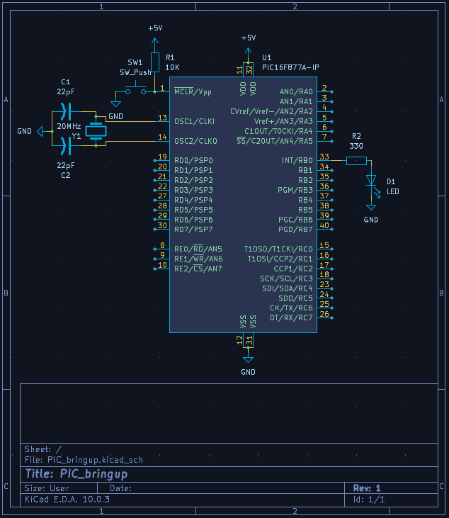
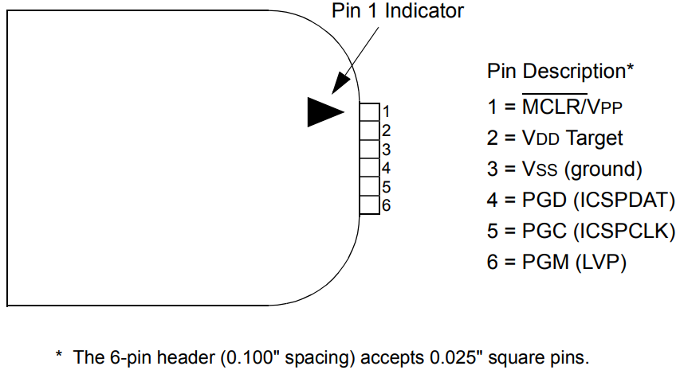
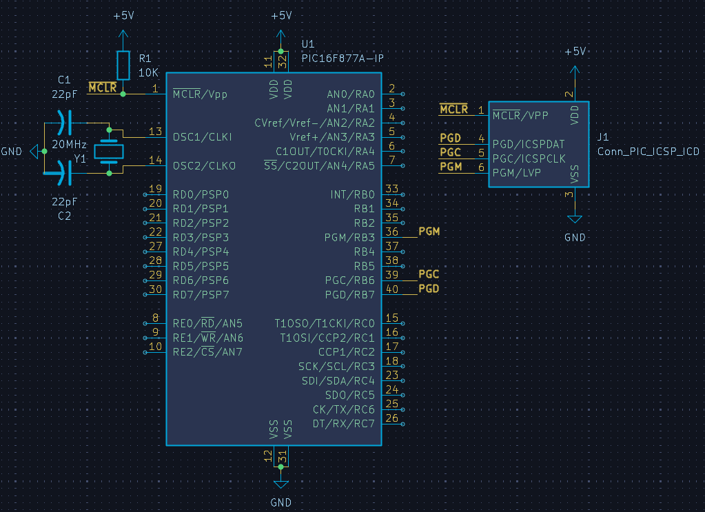
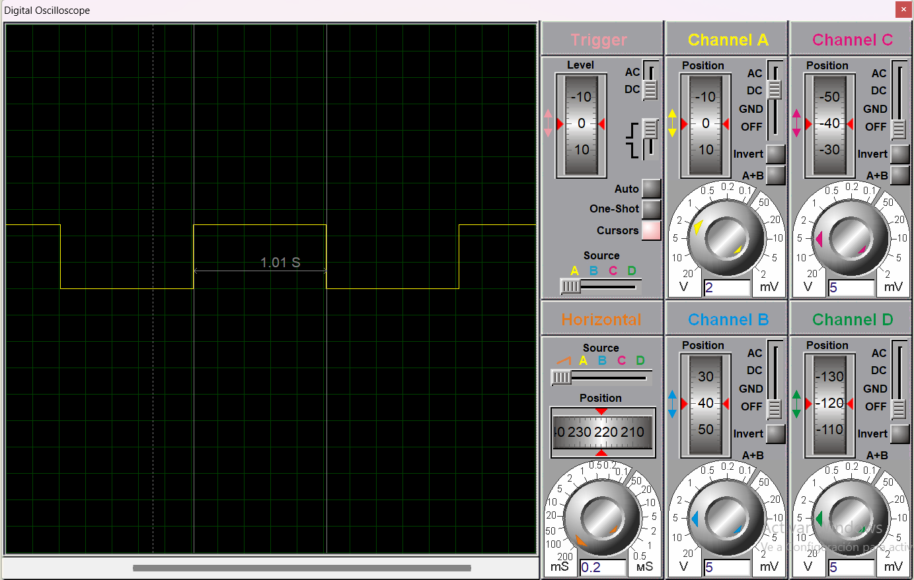
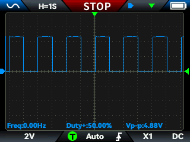
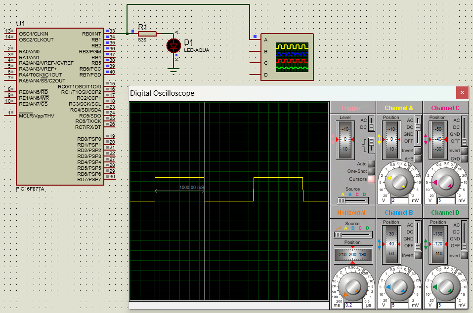
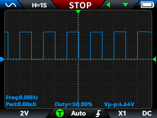
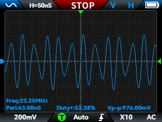

# 01 PIC Bringup

## What it Solves
Carga de código en el PIC16F877A mediante programación en circuito,
verificando el funcionamiento del MCU con un LED que alterna cada 1 segundo.

## Hardware and Environment
- MCU: PIC16F877A
- Toolchain: MPLAB X + XC8 + ICD2
- Critical components:
  - Oscilador externo 20MHz
  - Capacitores de carga 22pF
  - Resistencia de pull-up MCLR: 10kΩ
  - Resistencia de límite de corriente LED: 330Ω
  - Botón de reset

## Technical Constraints and Problem Found
El PIC16F877A no tiene oscilador interno utilizable a alta frecuencia,
por lo que FOSC debe configurarse en modo HS con cristal externo de 20MHz.
Sin esta configuración el MCU simplemente no arranca.

El problema principal apareció al intentar generar un retardo exacto de 1
segundo usando TMR0. En papel la matemática cuadra: se calcula el valor de
recarga, se espera el desbordamiento y se cuenta. El problema es que al
reescribir el registro TMR0 en software se consumen ciclos de instrucción
durante los cuales el timer ya está corriendo, introduciendo un error
acumulativo en cada iteración. Esto no es obvio al inicio porque el
datasheet describe el comportamiento del registro correctamente, pero no
enfatiza que la reescritura en ISR introduce deriva temporal medible.

La simulación confirmó el problema: con TMR0 el período resultante fue de
1.01 segundos en lugar de 1.00 segundo, error visible en Proteus y
confirmado en osciloscopio.

Un segundo problema es que el PIC16F877A no tiene registro latch en el
puerto B. Hacer toggle sobre RB0 leyendo el estado actual del pin es
inseguro porque el MCU ejecuta una operación read-modify-write sobre el
voltaje físico del pin, no sobre un registro interno. Si hay ruido o
capacitancia en la línea en el momento de la lectura, el valor leído puede
no corresponder al último valor escrito. Esto se identificó en el datasheet
antes de replicarlo físicamente.

## Alternatives Considered
- **TMR0 con recarga manual en ISR**
  Implementado físicamente. El timer desborda y en la rutina de interrupción
  se recarga el registro con el valor calculado. El problema es que los
  ciclos consumidos por las instrucciones de la ISR antes de recargar el
  registro ya no se recuperan, introduciendo un error acumulativo por cada
  desbordamiento. Simulación: 1.01s. Hardware: confirmado en osciloscopio.
  Descartado por deriva temporal inevitable con este método.

- **TMR1**
  TMR1 es de 16 bits frente a los 8 bits de TMR0, lo que reduce la
  frecuencia de desbordamiento y por tanto la frecuencia de recarga manual.
  Sin embargo el mecanismo de recarga sigue siendo por software en la ISR,
  por lo que la raíz del problema (ciclos perdidos en la recarga) persiste.
  Más bits no eliminan el error, solo lo distribuyen diferente.
  Descartado por análisis sin necesidad de implementación física.

## Solution Implemented
TMR2 resuelve el problema de raíz porque no requiere recarga manual.
El registro PR2 actúa como comparador: cuando TMR2 alcanza el valor de PR2
se resetea automáticamente por hardware y dispara la interrupción TMR2IF.
El software nunca toca el registro del timer, por lo que no hay ciclos
perdidos en la recarga.

La arquitectura final es la siguiente:
- TMR2 configurado con PR2=249, prescaler=4, postscaler=1, generando
  interrupciones cada 0.2ms.
- Una variable interna de 16 bits cuenta las interrupciones. Al llegar a
  5000 ha transcurrido exactamente 1 segundo.
- El estado del LED se mantiene en una variable booleana interna. El pin
  RB0 se escribe desde esa variable, nunca se lee para hacer toggle,
  evitando el problema de read-modify-write sobre el voltaje físico del pin.
- Programación mediante ICD2 para no depender de conexiones ICSP manuales
  en protoboard, que pueden introducir interferencia en las líneas PGC y PGD.

## How to Replicate

**1. Circuito mínimo**
Conectar el cristal de 20MHz entre OSC1 y OSC2 con capacitores de 22pF
a tierra en cada pin. Resistencia de 10kΩ entre VDD y MCLR. Ver esquemático:

Referencia de pines ICD2/PICkit3:

**2. Cálculo de PR2**

Tiempo de interrupción deseado: 0.2ms
$$PR2 = \frac{T \cdot F_{OSC}}{4 \cdot \text{Prescaler} \cdot \text{Postscaler}} - 1 = \frac{0.0002 \cdot 20000000}{4 \cdot 4 \cdot 1} - 1 = 249$$

**3. Contador de interrupciones para 1 segundo**
$$\text{contador} = \frac{1s}{0.2ms} = 5000$$

## Validation Evidence
### TMR0

**Simulación — TMR0 (período con deriva)**

**Hardware físico — osciloscopio con TMR0**

**Video — circuito funcionando con TMR0**

### TMR2
**Simulación — TMR2 (período correcto)**

**Hardware físico — osciloscopio con TMR2**

**Video — circuito funcionando con TMR2**

## Lessons Learned
- Los capacitores de carga del oscilador deben ser de 22pF. Valores mayores
  atenúan la señal de oscilación hacia tierra y el PIC no arranca. No hay
  mensaje de error, simplemente no funciona.
- Para verificar el oscilador con osciloscopio la punta debe estar en x10.
  En x1 la capacitancia de la punta carga el circuito oscilador y distorsiona
  o detiene la oscilación, dando una lectura falsa de fallo cuando el
  circuito en realidad está correcto.

  **Hardware físico — osciloscopio con OSC**
  
  
  
  **Video — circuito funcionando con TMR2**

  

- La reescritura manual de TMR0 en ISR introduce deriva temporal acumulativa
  porque los ciclos consumidos antes de recargar el registro no se recuperan.
  TMR2 con PR2 elimina este problema porque el reset del contador ocurre por
  hardware, sin intervención del software.

## Related Video
!!!Pendiente de publicación en YouTube.¡¡¡¡
