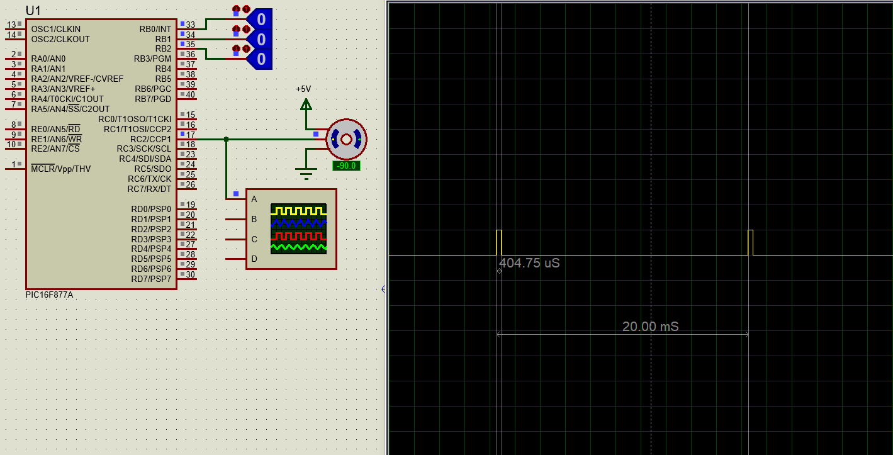
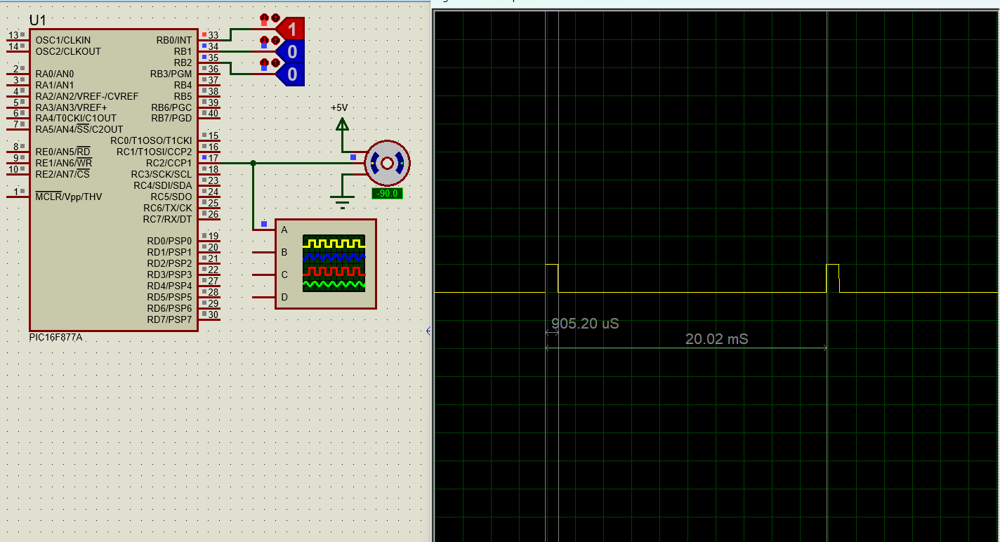
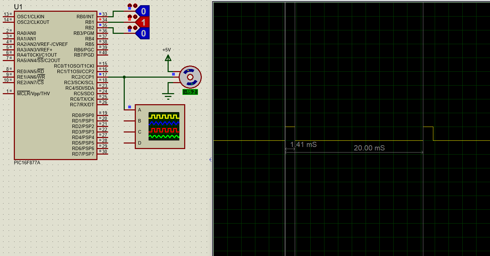
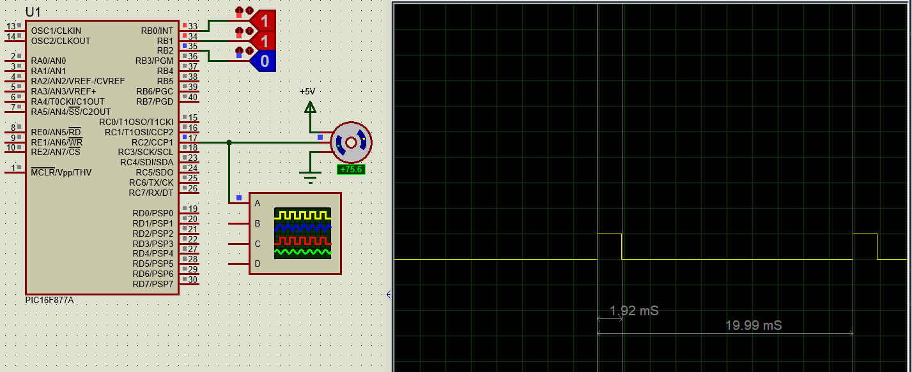
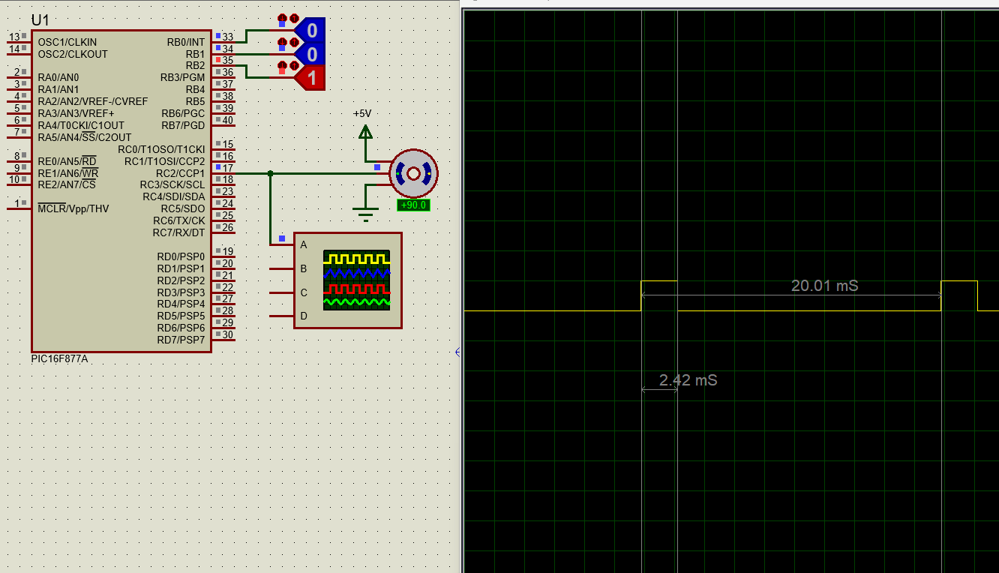
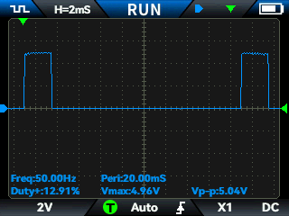
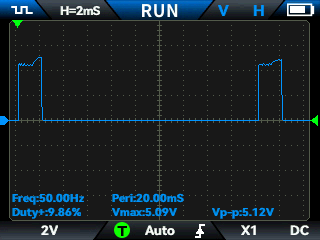
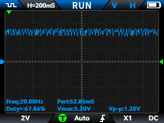
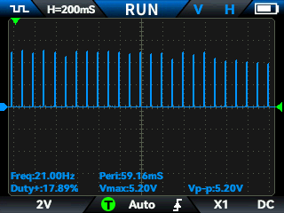

# Servo PWM — Control por TMR1 Compare en PIC

## What it Solves
Generación de señal PWM a 50 Hz con resolución de microsegundos para control
de servo motor desde un PIC con cristal de 20 MHz, sin usar el módulo CCP
en modo PWM estándar.

## Hardware and Environment
- MCU: PIC (familia midrange, RC2 como salida, CCP1 y TMR1 disponibles)
- Toolchain: MPLAB X IDE + XC8 Compiler
- Critical components:
  - Servo motor estándar (pulso 0.47 ms a 2.5 ms, periodo 20 ms)
  - Cristal externo 20 MHz
  - Fuente de alimentación independiente para el servo

## Technical Constraints and Problem Found
Un servo estándar requiere una señal de 50 Hz con ancho de pulso variable
entre aproximadamente 0.47 ms y 2.5 ms. Con Fosc = 20 MHz el módulo CCP en
modo PWM usa TMR2, cuyo periodo máximo útil no alcanza los 20 ms con
resolución de ancho de pulso suficiente para representar posiciones
intermedias con fidelidad. El cálculo de PR2 para 50 Hz con los prescalers
disponibles colapsa la resolución de duty cycle a unos pocos pasos discretos,
lo que hace el control impreciso.

El problema no era obvio al inicio porque el módulo PWM es la herramienta
natural para este tipo de señal. Solo al calcular PR2 para 50 Hz y comparar
los ticks disponibles para el duty cycle se hizo evidente que la resolución
era insuficiente.

Durante las pruebas apareció un segundo problema: vibración mecánica en el
servo. En el osciloscopio los flancos del pulso ocurrían en los momentos
correctos, lo que descartó un error de temporización en el firmware. Sin
embargo el nivel de voltaje de la señal caía durante el pulso activo. La
hipótesis inicial fue que el servo cargaba el pin de salida del PIC. Al
colocar la punta del osciloscopio en la línea de alimentación se observó que
era Vcc la que colapsaba en cada pulso. El servo demanda picos de corriente
que la fuente no puede entregar; la caída de Vcc arrastra al PIC y corrompe
la señal lógica. El problema no estaba en el firmware sino en la arquitectura
de potencia.

## Alternatives Considered
- **Módulo CCP en modo PWM con TMR2**
  Implementado inicialmente. Con Fosc = 20 MHz y los prescalers disponibles
  no es posible obtener simultáneamente 50 Hz y resolución de ancho de pulso
  suficiente para el rango angular del servo.
  Descartado por limitación matemática demostrada en el cálculo de PR2.

- **Generación por software con delays calibrados**
  Los delays bloqueantes impiden atender otras tareas y son sensibles a
  interrupciones, introduciendo jitter en la señal.
  Descartado por análisis sin implementación física.

## Solution Implemented
TMR1 en modo libre con prescaler 1:2 produce un tick de 0.4 µs. Cargando
TMR1 = 15536 en cada desbordamiento se obtiene un periodo exacto de 20 ms
(50 Hz). El módulo CCP1 se configura en modo Compare con interrupción de
software: al desbordarse TMR1 se levanta RC2 iniciando el pulso; cuando el
contador alcanza el valor en CCPR1 se baja RC2 terminando el pulso. El ancho
queda determinado por la diferencia entre el valor de recarga y CCPR1.

`Servo_Init` recibe Tmin y Tmax en segundos y calcula la ordenada al origen
`b` y la pendiente `m` de la recta que mapea porcentaje (0–100) a valor de
CCPR1. `Servo_Set` aplica la recta. `Servo_Ang` convierte un ángulo entero
(0–250°) a porcentaje antes de llamar a `Servo_Set`. `ISR_Servo` debe
colocarse dentro del bloque de interrupciones del proyecto.

Esta arquitectura no bloquea el CPU entre pulsos y encapsula toda la lógica
del servo en un driver reutilizable.

## How to Replicate
1. Configurar Fosc = 20 MHz en los bits de configuración del PIC.
2. Incluir `Servo.h` y `Servo.c` en el proyecto MPLAB X.
3. En la inicialización llamar `Servo_Init(0.00047, 0.0025)`.
4. Dentro del vector de interrupción del proyecto invocar `ISR_Servo()`.
5. Usar `Servo_Ang(angulo)` con valores de 0 a 250 para posicionar el servo.
6. Conectar la alimentación del servo a una fuente independiente.
   Compartir únicamente la referencia de tierra con el PIC.
7. Verificar con osciloscopio periodo de 20 ms y ancho de pulso
   correspondiente al ángulo comandado.

**Cálculo del tick de TMR1**

Con Fosc = 20 MHz y prescaler 1:2:

$$T_{tick} = \frac{4}{F_{OSC}} \cdot \text{Prescaler} = \frac{4}{20\,000\,000} \cdot 2 = 0.4\,\mu s$$

**Cálculo del valor de recarga para 20 ms**

$$TMR1_{recarga} = 65536 - \frac{20\,ms}{0.4\,\mu s} = 65536 - 50000 = 15536$$

**Cálculo de b y m en Servo_Init**

$$b = \frac{T_{min}}{0.4\,\mu s} + 15536$$

$$m = \frac{\frac{T_{max}}{0.4\,\mu s} + 15536 - b}{100}$$

## Validation Evidence

Ancho de pulso al 0 %:

Ancho de pulso al 25 %:

Ancho de pulso al 50 %:

Ancho de pulso al 75 %:

Ancho de pulso al 100 %:

Posición en 250°:

Jitter con fuente compartida — resolución 2 ms/div:

Caída de Vcc — vibración de 1.2 Vpp en alimentación:

Jitter con fuente compartida — detalle:

Las capturas de 0 % a 100 % confirman la variación lineal del ancho de pulso
sobre un periodo estable de 20 ms. Las capturas de jitter y Vcc documentan
el efecto de la fuente compartida antes de separar las alimentaciones.

## Lessons Learned
- El módulo PWM estándar con TMR2 no es adecuado para señales de 50 Hz con
  resolución de ancho de pulso fina cuando Fosc es alta. El modo Compare con
  TMR1 resuelve ambos requisitos simultáneamente.
- Una vibración mecánica en un servo no indica necesariamente un error de
  firmware. Medir la línea de alimentación es el primer paso de diagnóstico;
  una fuente subdimensionada produce caídas de Vcc que corrompen la señal
  lógica antes de que el código tenga oportunidad de fallar.
- Separar la alimentación de actuadores y microcontroladores no es
  recomendación opcional. Es un requisito de diseño cuando el actuador
  genera picos de corriente que la fuente de señal no puede sostener.

## Related Video
[Agregar link al video de YouTube]